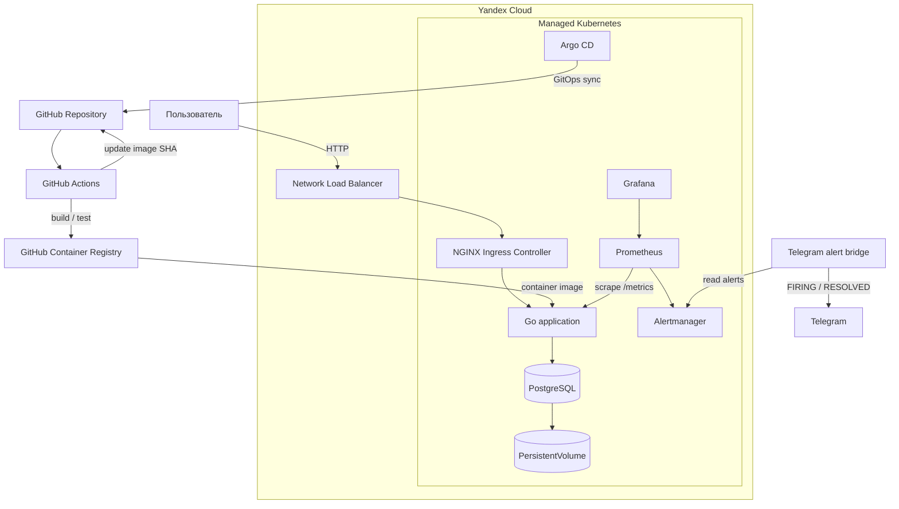

# Архитектура проекта

Проект развёртывается в Yandex Cloud на базе Managed Service for Kubernetes.
Инфраструктура создаётся Terraform, приложение доставляется в кластер по GitOps-модели через Argo CD.

## Схема

## Компоненты

Приложение написано на Go и предоставляет веб-интерфейс калькулятора, health/readiness endpoints и Prometheus-метрики. История операций хранится в PostgreSQL.

Terraform создаёт сеть, подсеть, security group, service account, Managed Kubernetes cluster и node group в Yandex Cloud.

NGINX Ingress Controller публикует приложение через Network Load Balancer. Публичный hostname формируется как `<EXTERNAL-IP>.nip.io`.

Helm chart описывает приложение и PostgreSQL. PostgreSQL использует PersistentVolumeClaim, поэтому данные сохраняются при пересоздании Pod.

GitHub Actions выполняет тестирование и сборку контейнерного образа. Образ публикуется в GHCR с immutable-тегом `sha-<commit>`. Для ветки `main` workflow обновляет production values в Git.

Argo CD отслеживает Git-репозиторий и автоматически синхронизирует production-состояние Kubernetes с Git.

Prometheus собирает метрики приложения через ServiceMonitor. Grafana используется для визуализации. PrometheusRule содержит алерты `ApplicationDown` и `HTTPErrorBurst`.

Alertmanager работает внутри Kubernetes. Из-за недоступности Telegram API непосредственно из облачного кластера небольшой bridge на управляющем Ubuntu-сервере получает активные alerts из Alertmanager и отправляет состояния FIRING/RESOLVED в Telegram.

## Поток доставки

Изменение приложения проходит следующий путь:

`Git push -> GitHub Actions -> tests -> GHCR -> GitOps commit -> Argo CD -> Kubernetes`

Таким образом, production Deployment обновляется через GitOps, а не ручным изменением ресурсов Kubernetes.
